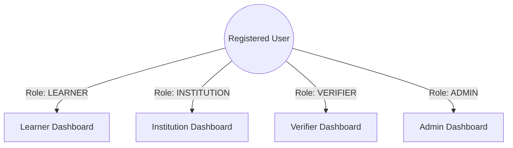

a# Credencify — Role Dashboards & Database Design Plan

## 1. Roles & Dashboard Requirements

To make Credencify a hackathon or enterprise-grade platform, we need **four** distinct roles:



### A. Role: `LEARNER` (The Student)
* **Registration Data:** Email, Password, Full Name (Minimal data).
* **Profile Data (Completed Later):** Date of Birth, Gender, Phone Number, Address (City, State, Country, Postal Code), Profile Image.
* **Dashboard View:**
  * View certificates issued to their email/ID.
  * Download PDF of certificates.
  * Share verification links with employers.
  * View profile details.

### B. Role: `INSTITUTION` (The Issuer)
* **Registration Data:** Email, Password, Institution Name, Role (Minimal data).
* **Profile Data (Completed Later):** Institution Code, Institution Type (University, Board, Bootcamp), Registration/Licensing Number, Website URL, Address, Logo Image.
* **Dashboard View:**
  * "Issue Certificate" form.
  * List of all issued certificates with real-time status (`PENDING`, `ISSUED`, `FAILED`, `REVOKED`).
  * "Revoke Certificate" controls.
  * Statistics panels (Total Issued, Success Rate, Active Revocations).

### C. Role: `VERIFIER` (The Checker - *New Role*)
* **Registration Data:** Email, Password, Full Name, Organization Name.
* **Profile Data (Completed Later):** Industry Type, Business Verification Status, Contact Phone.
* **Dashboard View:**
  * Lookup search bar (Verify by Certificate ID).
  * OCR Upload Panel (Upload Certificate PDF/Image).
  * History of verification attempts.
  * "Report Mismatch" form.

### D. Role: `ADMIN` (Platform Manager)
* **Registration Data:** Set up directly in the database (not public).
* **Dashboard View:**
  * Institution Approval Board (Approve/Reject new registering institutions before they can call the blockchain).
  * System health metrics (Blockchain transaction delay, API gateway traffic).
  * Mismatch Report Review Center.

---

## 2. Microservice Database Division ("Database-per-Service" Rule)

In a microservice architecture, **one service must never query another service's database directly**. Data sharing happens strictly through HTTP/Feign API calls.

```text
  [Auth Service]            [Credential Service]          [Verification Service]
        ↓                            ↓                              ↓
  [( auth_db )]               [( credential_db )]           [( verification_db )]
  - users                     - certificates                - verification_requests
  - learner_profiles                                        - mismatch_reports
  - institution_profiles
```

### A. Auth Database (`auth_db` — Owned by `auth-service`)

#### Table: `users`
*Tracks authentication credentials and roles.*
* `id` (Long, PK, Auto Increment)
* `user_id` (String/UUID, Unique) — *Global Identifier used by other services*
* `email` (String, Unique)
* `password` (String, BCrypt Hashed)
* `role` (Enum: `ADMIN`, `INSTITUTION`, `LEARNER`, `VERIFIER`)
* `status` (Enum: `PENDING`, `ACTIVE`, `BLOCKED`)
* `created_at` (Timestamp)

#### Table: `learner_profiles`
*Holds private student details. Kept separate so the `users` table stays fast.*
* `id` (Long, PK)
* `user_id` (String/UUID, FK to `users.user_id`)
* `dob` (Date)
* `gender` (String)
* `phone_number` (String)
* `address`, `city`, `state`, `country`, `postal_code` (Strings)
* `profile_image_url` (String)

#### Table: `institution_profiles`
*Holds institution licensing and metadata.*
* `id` (Long, PK)
* `user_id` (String/UUID, FK to `users.user_id`)
* `institution_code` (String, Unique)
* `institution_type` (String)
* `reg_no` (String)
* `website_url` (String)
* `address`, `city`, `state`, `country`, `postal_code` (Strings)
* `logo_url` (String)
* `is_approved` (Boolean, default: `false`) — *Admin must flip this to true*
* `approved_at` (Timestamp)

---

### B. Credential Database (`credential_db` — Owned by `credential-service`)

We do **not** need a separate "blockchainrecord" table. To avoid database locks and complexity, we merge the transaction details directly into the `certificates` table.

#### Table: `certificates`
*Tracks the official issued certificates.*
* `id` (Long, PK, Auto Increment)
* `certificate_id` (String, Unique)
* `learner_name` (String)
* `course_name` (String)
* `institution_name` (String)
* `institution_id` (String/UUID) — *References user_id of the issuing institution*
* `learner_email` (String, Optional) — *Used to automatically map certificates to Learners when they sign up*
* `certificate_hash` (String) — *The generated SHA-256 hash proof*
* `transaction_hash` (String) — *The blockchain TX hash from Web3j*
* `block_number` (Long, Optional) — *Block number where the transaction was mined*
* `status` (Enum: `PENDING`, `ISSUED`, `FAILED`, `REVOKED`)
* `created_at` (Timestamp)
* `revoked_at` (Timestamp, Nullable)
* `revocation_reason` (String, Nullable)

---

### C. Verification Database (`verification_db` — Owned by `verification-service`)

#### Table: `verification_requests`
*Audit trail of verifications.*
* `id` (Long, PK, Auto Increment)
* `certificate_id` (String)
* `verifier_name` (String)
* `verifier_email` (String)
* `verifier_organization` (String)
* `verification_method` (Enum: `QR_CODE`, `MANUAL_ID`, `OCR_AI`)
* `verification_status` (Enum: `VERIFIED`, `MISMATCH`, `NOT_FOUND`)
* `remarks` (String)
* `verified_at` (Timestamp)

#### Table: `mismatch_reports`
*Submitted when a verifier detects tampered details.*
* `id` (Long, PK, Auto Increment)
* `verification_request_id` (Long, FK)
* `certificate_id` (String)
* `description` (Text)
* `status` (Enum: `SUBMITTED`, `UNDER_REVIEW`, `RESOLVED`)
* `created_at` (Timestamp)

---

## 3. Workflows & Service Communication

```text
[Frontend Portal]  ────(1. Update Profile)────>  [Auth Service]
                                                       │
                                                 (Saves to auth_db)
                                                       │
                                                       ▼
[Frontend Portal]  ────(2. Issue Request)────>  [Credential Service]
                                                       │
                                                 (Checks Auth token)
                                                       │
                                                       ├──(Feign Post Hash)──> [Blockchain Service]
                                                       │
                                                 (Saves to credential_db)
```

### Flow 1: Registration & Profile Completion
1. User registers with **Email + Password + Role** through `auth-service`. Account status is `ACTIVE` (or `PENDING` for institutions).
2. The user signs in, and the frontend checks if their profile is completed. If not, it redirects them to the profile page.
3. The user inputs their profile details. The frontend hits `PUT /api/v1.0/auth/profile` in `auth-service`.
4. `auth-service` saves the details to `learner_profiles` or `institution_profiles`.

### Flow 2: Authenticated Certificate Creation
1. An Institution logs in and requests certificate creation via frontend.
2. The request goes to `credential-service`. Along with it, the API Gateway or Auth token passes the validated `institution_id` (which matches the institution's `user_id` in `auth_db`).
3. `credential-service` verifies the institution is approved, generates the hash, makes the Feign call to `blockchain-service` to commit the hash to Sepolia, and writes the record to `credential_db`.

---

## 4. Proposed Development Order for the Team

Since your team wants to learn step-by-step, here is how they should upgrade their databases:

* **Teammate 1:** Work on the **Auth Service Database** (creating the `users` and `learner_profiles` / `institution_profiles` entities, configuring mapping, and writing a service method to update profiles).
* **Teammate 2:** Work on the **Credential Service Database** (updating `CertificateEntity` to include the `status` enum correctly, mapping it as `@Enumerated(EnumType.STRING)`, and adding fields for `transaction_hash`, `block_number`, and `institution_id`).
* **You:** Work on the API Gateway and Auth JWT propagation so that the `institution_id` from the Auth Token is automatically passed to the `credential-service` when creating certificates.
