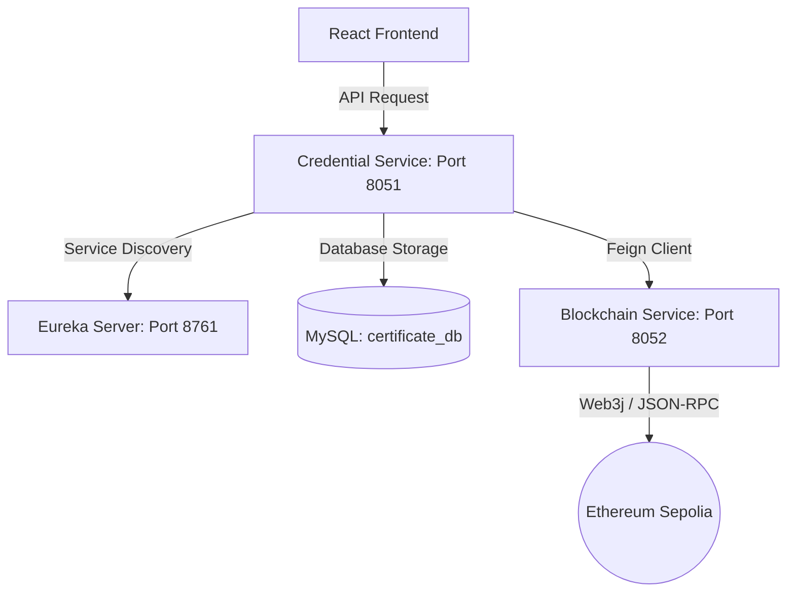

# Credencify - Blockchain Credential Verification System

Credencify is a decentralized, secure, and tamper-proof digital credential issuance and verification platform. It combines the scalability of Spring Boot microservices with the immutable security of the Ethereum (Sepolia Testnet) blockchain.

---

## 🏗️ Architecture Overview

The backend is built as a Spring Cloud microservice architecture consisting of the following services:



1. **`eureka-server` (Port `8761`)**: Serves as the central Service Registry. All microservices register themselves here, allowing load-balanced communication via Feign Clients.
2. **`blockchain-service` (Port `8052`)**: Handles smart contract interaction using **Web3j**. It signs and submits transactions to the Ethereum Sepolia network via Alchemy.
3. **`credential-service` (Port `8051`)**: The core orchestrator. It manages the MySQL database for credential records and acts as the gatekeeper calling the `blockchain-service`.
4. **`auth-service`**: Handles authentication and security, backed by its own MySQL database.

---

## 💾 Database Working & Design

The platform uses a hybrid storage model:
* **Off-chain Storage (MySQL):** Used to store plain-text metadata (learner names, course names, and institution names) so they can be retrieved and displayed on the UI.
* **On-chain Storage (Blockchain):** Used to store the unique SHA-256 hash of the combined certificate details. This makes the certificate tamper-proof.

### Database Schema (credential-service)
Connected to MySQL database: `certificate_db`.

The `certificates` table is mapped using **JPA/Hibernate** to `CertificateEntity`:
* `id` (Primary Key): Auto-incremented local ID.
* `certificate_id` (VARCHAR): The unique verification ID generated/assigned to the certificate.
* `learner_name` (VARCHAR): The recipient of the credential.
* `course_name` (VARCHAR): The name of the completed course.
* `institution_name` (VARCHAR): The issuing organization.
* `certificate_hash` (VARCHAR): The SHA-256 hash generated from combining the certificate fields.
* `transaction_hash` (VARCHAR): The Ethereum transaction hash received from the blockchain as proof of write.
* `status` (VARCHAR): Enum (`ISSUED`, `REVOKED`, etc.) representing the state.
* `created_at` (TIMESTAMP): The local database recording time.

---

## 🔄 Core Workflows

### 1. Issuance Workflow (POST `/api/certificates`)
1. React Frontend sends plain-text certificate details to `credential-service`.
2. `credential-service` combines the fields into a formatted string:
   $$\text{certificateId} \parallel \text{learnerName} \parallel \text{courseName} \parallel \text{institutionName}$$
3. It computes the **SHA-256 hash** of this string.
4. It calls `blockchain-service` via **Feign Client** (`storeHash(certificateId, hash)`).
5. `blockchain-service` sends a transaction calling the smart contract `CertificateStorage.sol` using Web3j.
6. The blockchain mining receipt is returned back.
7. `credential-service` saves the complete plain-text details plus the transaction and certificate hashes into its local MySQL database (`certificates` table).

### 2. Verification Workflow (GET `/api/certificates/{certificateId}`)
1. React Frontend calls the verification endpoint.
2. `credential-service` queries the blockchain via `blockchain-service` for the hash corresponding to the `certificateId`.
3. The smart contract queries its mapping and returns the stored `bytes32` hash.
4. **Verification Validation:** The returned hash is sent to the frontend. If it is non-zero, the certificate is verified as authentic.

---

## 🛠️ Developer Guide: How to Extend the Project

If you are a developer extending this system, follow these practices to keep services aligned:

### 1. If you modify the Smart Contract (Solidity)
If you add functions or change variable types (e.g., changing parameter types in `storeHash`):
1. **Recompile the contract** to get the new `.abi` and `.bin` files:
   ```bash
   solc --abi --bin -o build/ CertificateStorage.sol
   ```
2. **Regenerate the Java Wrapper** using the Web3j CLI:
   ```bash
   web3j generate java -a build/CertificateStorage.abi -b build/CertificateStorage.bin -o src/main/java -p com.credencify.blockchainservice.wrapper
   ```
3. **Deploy the contract** to the testnet, update `contract.address` in your `blockchain-service/src/main/resources/application.properties`, and restart the service.

### 2. If you change API parameters (API alignment)
When changing requests or responses:
1. Update DTOs in **both** `blockchain-service` and `credential-service`.
2. Update the Feign Client interface (`BlockchainClient.java`) in `credential-service` to match the signatures.
3. **HTTP Status Practice:** Always return `HttpStatus.OK` (200) or `HttpStatus.CREATED` (201) for successful REST responses. **Never use `HttpStatus.FOUND` (302) to return JSON data**, as the browser `fetch` API will attempt to follow it as a redirect and fail.

### 3. Local Development Tip (Sharing APIs)
Do not commit local IP changes or environment-specific URLs to Git:
1. Use **`.env` files** in your frontend. Add `.env` to your `.gitignore`.
2. In the `.env` file, store the server's IP address:
   ```env
   VITE_API_HOST=192.168.1.50
   ```
3. In your JSX files, construct the URL dynamically:
   ```javascript
   const response = await fetch(`http://${import.meta.env.VITE_API_HOST}:8051/api/certificates/${id}`);
   ```
